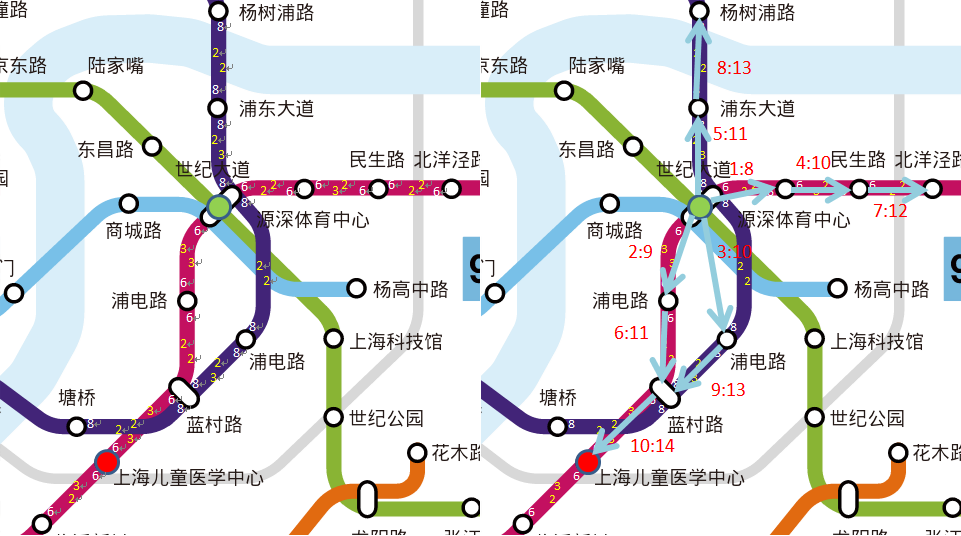

# 地铁图快速寻路算法

Ianus Inferus(地狱门神, Rex)

2012-08-12

## 1.概述

这两天，博客园里有人谈论到[地铁图](http://www.cnblogs.com/lavezhang/archive/2012/08/08/2629175.html)的实现，而之前我也和NeoRAGEx2002同学做了一个Android地铁图应用，因此，对于地铁图的寻路算法，我觉得有必要专门写一篇博客来给出我们的解决方案，供大家参考。本文所述算法的时间复杂度为O(\|E\|log\|E\|)，其中\|E\|为边的数量。


## 2.概念

### 1)点和边

基础元素为点(地铁站)和边(两个相邻站之间的有向轨道)。

例如，经过莘庄站有1号线和5号线，含有莘庄站的边有4条，经过世纪大道站有4条线路，含有世纪大道站的边有8条。

### 2)运营段

在边的基础上，还有运营段的概念，即一组连续边的集合。

例如，1号线有莘庄-富锦路(发车间隔8分)、莘庄-上海火车站(发车间隔6分)、上海南站-富锦路(发车间隔8分)、上海南站-上海火车站(发车间隔6分)、富锦路-莘庄(发车间隔8分)、上海火车站-莘庄(发车间隔6分)等运营段。

### 3)代价

寻路算法的依据可以为时间、换乘次数、经过边数等任意非负代价，这里着重对时间进行建模。

每条边有一个乘坐时间代价，表示乘坐地铁经过该边所需要花费的时间。

每个运营段有一个等车时间代价，为通过该运营段中的边乘车需要等车的时间，通常可以假设为发车间隔时间(等车时间的最大值)或者发车间隔时间的一半(等车时间的数学期望)。

在每个点有一个换乘时间代价矩阵，表示在任意两条边之间换乘所需要花费的时间。两边之间的关系有直接连通、换乘、不连通三种。连通的换乘时间代价为0，换乘的换乘时间代价为换乘行走时间+等车时间，不连通的换乘时间代价为+∞。这个矩阵可以用稀疏矩阵表示，不连通的两边不出现。由于地铁的设计使得我们不需要考虑沿着某条线路折返的路线，我们可以将一边和它的相反边看做不连通而不是换乘，这样可以降低图的复杂度。

## 3.算法

### 1)思路

传统的最短路径算法很多，比如

* Dijkstra算法，不过这种算法没有办法解决换乘时间代价问题。
* 广度优先算法，在加权图的时候无法得到最优解。
* 受限的深度优先算法，能得到结果，但路径比较长时算法时间过长。

我们可以考虑这样一个自然现象，雪水在山峰上融化，然后流经各个山谷。各站点就是山谷中的点，换乘站点就是山谷分成多股的交叉点。

假设起始点是山峰，水沿着各边扩散，经过一边的用时和边上的乘坐时间代价一样，从一边到一邻边，需要等待换乘时间代价。不停往起始点倒水，水不停流动，当水到达终止点时，水流经过的路径就是我们所需要的最短路径。

这个模型的问题在于水可以有多股水流同时流动，但是我们的算法应该有一个顺序，我们可以假设有一个水流切线，表示所有水流的最前端位置。任意边e，当其起点被水流所覆盖，而终点没有被水流覆盖时，将e加入按代价排序的切线边列表C(红黑树或平衡树实现)，并记录e->水流经过的上一边。继续让水流动，则C中的第一个边e的终点最先被水流所覆盖，从C中移除e。当到达寻路的终止点时，我们可以通过从最后一条边开始回溯上一边，再上一边的上一边，直到寻路的起点，这样就获得了所需要的路径。

算法也可以不在终点结束，而直到水流覆盖地图上的所有点，对性能并没有明显的影响。

### 2)例子

如图1所示：



　　　　　　　　图1(a) 时间代价　　　　　　　　　　　　　　　　　　　　　　　　　　　　　　　　图1(b) 搜索顺序

为了简化问题，我们假设2号线(绿色)和9号线(水色)不存在，只考虑4号线(深蓝色)和6号线(紫红色)。

图1(a)中表示了4号线和6号线的边的时间代价，其中白色表示等车时间，黄色表示乘车时间。

我们假设每个换乘站，换乘时的行走时间为4分钟。

图1(b)表示了搜索顺序，对于相同的代价，其搜索顺序不定，由切线边列表C的实现决定。

例子中的起始点为世纪大道，终止点为上海儿童医学中心。

切线边列表C的变化如下

    {1, 2, 3, 5}
    {2, 3, 4, 5}
    {3, 4, 5, 6}
    {4, 5, 6, 9}
    {5, 6, 7, 9}
    {6, 7, 8, 9}
    {7, 8, 9, 10, .., ..}
    {8, 9, 10, .., .., ..}
    {9, 10, .., .., .., ..}
    {10, .., .., .., .., ..}

需要注意到消去6的时候，增加了10、(蓝村路, 塘桥)、9的反向边三条边，消去9的时候，增加了6的反向边。
消去9时，会再次搜索到10，此时的时间代价为13+4+8=25，但因为10已经记录了其上一边，所以不再加入C。

### 3)实现

伪代码如下：

```
record Vertex //点
    InEdges:List<Edge> //进站边
    OutEdges:List<Edge> //出站边
    Connection:Map<Tuple<Edge, Edge>, EdgeConnection> //边连接矩阵，包含换乘行走时间代价，当不连接时不存在

record Edge //边
    Start:Vertex //起点
    End:Vertex //终点
    Cost:Int //乘坐时间代价
    Ranges:List<Range> //运营段

record Range //运营段
    Edges:List<Edge> //边
    Cost:Int //等车时间

taggedunion EdgeConnection
    Connected:Unit //直接连接
    Transferable:Int //换乘，行走时间代价

CalculateRoute(Start:Vertex, End:Vertex):List<Edge>
    if Start == End
        return new List<Edge>() //起始点和终止点重合

    let Previous <- new Map<Edge, Edge>() //边到上一边的映射
    let cmp <- (Comparer<Edge>)(...) //路径代价比较函数，将在下面给出
    let CutEdges <- new RedBlackTree<Edge>(cmp) //水流切线边列表

    foreach o in Start.OutEdges
        CutEdges <- CutEdges + o
        Previous <- Previous + (o, null)

    let e <- (Edge)(null) //终边

    while CutEdges.Count > 0
        let i <- CutEdges.First
        CutEdges <- CutEdges - i

        let s <- i.End
        if s == End
            e <- i
            break

        foreach o in s.OutEdges
            if !s.Connection.ContainsKey((i, o))
                continue

            if Previous.ContainsKey(o)
                continue

            Previous <- Previous + (o, i)
            CutEdges <- CutEdges + o

    if e == null
        return null //没有路径

    let l <- new List<Edge>()
    while e != null
        l <- l + e
        e <- Previous(e)

    return l.Reverse()
```

下面为当寻路依据为时间时的比较函数

```
let Time <- new Map<Edge, Int>()
let Range <- new Map<Edge, Range>()
let GetBestRange <- l:List<Range> => l.OrderBy(r => r.Cost).First
let GetTime <-
    e =>
        if e == null
            return 0
        if Time.ContainsKey(e)
            return Time(e)
        let p <- Previous(e)
        let v <- GetTime(p)
        if p != null
            let c <- e.Start.Connection((p, e))
            if c
            | Connected ->
                let rgOld <- Range(p)
                let rg <- GetBestRange(p.Ranges.Intersect(e.Ranges))
                Range <- Range + (e, rg)
                if rgOld != rg
                    v <- v - rgOld.Cost + rg.Cost
            | Transferable t ->
                let rg <- GetBestRange(e.Ranges)
                Range <- Range + (e, rg)
                v <- v + rg.Cost + t
        else
            let rg <- GetBestRange(e.Ranges)
            Range <- Range + (e, rg)
            v <- v + rg.Cost
        v <- v + e.Cost
        Time <- Time + (e, v)
        return v
let cmp <-
    (l:Edge, r:Edge) =>
        return GetTime(l) - GetTime(r)
```

下面为当寻路依据为换乘次数时的比较函数

```
let TransferCount <- new Map<Edge, Int>()
let GetTransferCount <-
    e =>
        if e == null
            return 0
        if TransferCount.ContainsKey(e)
            return TransferCount(e)
        let p <- Previous(e)
        let v <- GetTransferCount(p)
        if p != null
            let c <- e.Start.Connection((p, e))
            if c
            | Connected ->
                ()
            | Transferable _ ->
                v += 1
        TransferCount <- TransferCount + (e, v)
        return v
let cmp <-
    (l:Edge, r:Edge) =>
        return GetTransferCount(l) - GetTransferCount(r)
```

下面为当寻路依据为经过边数时的比较函数

```
let StopCount <- new Map<Edge, Int>()
let GetStopCount <-
    e =>
        if e == null
            return 0
        if StopCount.ContainsKey(e)
            return StopCount(e)
        let p <- Previous(e)
        let v <- GetStopCount(p) + 1
        StopCount <- StopCount + (e, v)
        return v
let cmp <-
    (l:Edge, r:Edge) =>
        return GetStopCount(l) - GetStopCount(r)
```

## 4.算法复杂度

认为点的入站边和出站边很少，覆盖每条边的运营段很少，并注意到GetTime运行时递归的部分总会在Time变量中缓存，可知时间比较函数的复杂度为O(1)。
CutEdges的红黑树插入删除的复杂度为O(log|E|)。
所有边最多进出CutEdges一次，可知整个算法的复杂度为O(|E|log|E|)。

## 5.结果

本文所述算法能够在O(|E|log|E|)时间内快速得到全局最佳路径。
在1GHz的单CPU手机上实测得到的上海地铁(11条线路214站)任意两站点之间的寻路时间均为200ms以下。

[back](../../)
