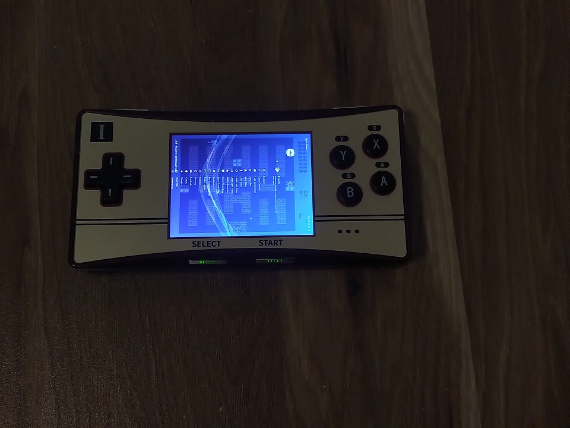
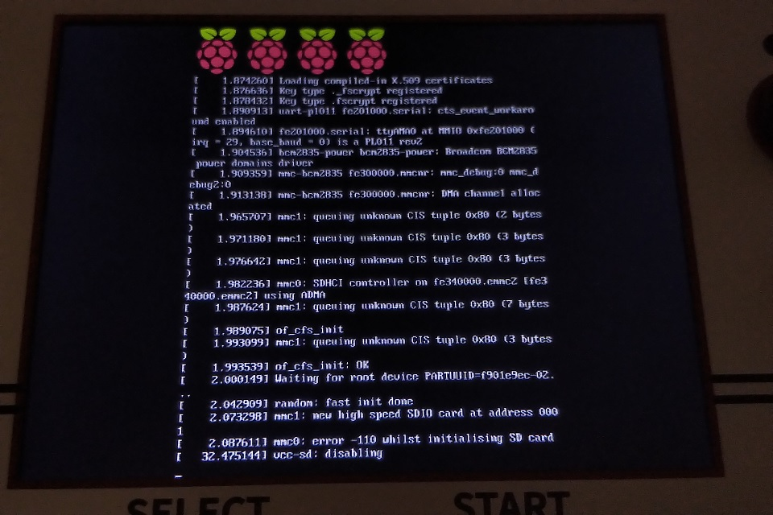

# 微雪GPM2804掌机使用感想

Ianus Inferus

2021-10-11

买微雪的[GPM2804](https://www.waveshare.net/wiki/GPM2804)掌机有一段时间了，这里说下感想。

## 硬件

外壳看上去很高级，但手持时容易出汗，产生一种特殊的油腻感。

重量轻，仅171.4g。

屏幕为2.8英寸IPS屏幕，640x480，RGB排列，竖屏旋转，像素密度(PPI)为285.7。

重量和屏幕的对比可以参考我之前的博客[掌机的重量和屏幕](20211004_handhelds.html)。

声音只有单喇叭且音量较小，有3.5mm耳机孔，用耳机会比较好。

MicroUSB无法连接键盘等外设，似乎只能供电。主板上三个开关的功能似乎分别控制是否使用USB接口、SD卡、按键。需要额外的IO板才能刷写eMMC(如果CM4带eMMC)或更换EEPROM固件。

没有视频输出功能。

WiFi为Raspberry Pi CM4核心板上搭载，支持802.11ac (2.4GHz和5.8GHz)，可以正常连2.4GHz，但默认5.8GHz兼容性差。解决方法见软件部分。

蓝牙和WiFi集成在同一个芯片上，可以连接八位堂SN30Pro手柄和蓝牙键盘(退出到shell仍然可用)，不支持Bose QuietControl 30耳机(可能是软件问题)。

SD卡插槽和外壳之间有空隙，容易把SD卡插到机器内部去，需要拆开外壳拿出。

电池大小为3.7V 3500mAh，续航比上一代产品GPM2803强，我玩了一下午3～4个小时才没电。

## 软件

当前适配的系统为RetroPie，菜单为EmulationStation，模拟器前端为RetroArch。

由于屏幕是竖屏旋转而来，而Raspberry Pi 4不再支持display_rotate启动选项，且RetroArch菜单无法配置旋转，导致菜单会旋转90度，目前暂无解决方法，需要在RetroArch上适配。

WiFi 5.8GHz兼容性差是驱动问题(在`wpa_supplicant.conf`中将区域设置为CN后，输入`iw phy phy0 channels`可以发现36-48、52-64等可用信道被禁用，部分解决方法参考 [这里](https://github.com/raspberrypi/firmware/issues/1359) [这里](https://www.raspberrypi.org/forums/viewtopic.php?f=117&t=291609))。

SD卡启动在我的机器上不兼容SanDisk的32GB(普通版)和64GB(Extreme版)。安装RetroPie后开机一直显示黑屏并在最上方闪烁光标，在`/boot/cmdline.txt`中移除所有的quiet，加上debug之后，提示`mmc0: error -110 whilst initialising SD card`，尝试了更换EEPROM固件(pieeprom-2021-02-16.bin、pieeprom-2021-07-06.bin、pieeprom-2021-10-05.bin，参考[RaspberryPie EEPROM固件](https://github.com/raspberrypi/rpi-eeprom/tree/master/firmware))也没有什么作用，但相同的CM4和SD卡放到另外一个IO板上却可以正常启动(`config.txt`和`cmdline.txt`略有差异)。我听说有其他机器可以正常使用SanDisk的SD卡，可能我遇到的这个问题为个案。另外我使用的CM4为带WiFi不带eMMC内存4GB的CM4-Lite，而完整版机器自带的为带WiFi不带eMMC内存1GB的CM4-Lite，略有差异，不知道有没有关系。

闲置时缺乏睡眠机制，只能在主菜单按Select键息屏，但仍然会发热。

进入shell的方法有通过WiFi进行ssh和通过蓝牙键盘配对直接操作两种，但是都存在搞坏系统后无法通过U盘和USB键盘启动系统需要将SD卡拿到另外的Linux机器上挂载修复的问题。

无法从屏幕或者命令行获得电池电量，只能通过下方SELECT、START键的灯来观察，分为绿灯、蓝灯、红灯三档，充电时灯会闪烁。

尝试在4GB内存的CM4-Lite上安装[Windows on Raspberry Pi](https://www.worproject.ml/)，点亮屏幕后无显示，而在另外一个IO板上可以正常启动，怀疑是由于屏幕分辨率没有适配的原因(屏幕分辨率因为竖屏旋转的关系，实际上是480x640，而Windows on Raspberry Pi的配置中只有似乎640x480等正常分辨率和Native Resolution可选择)。

## 游戏

SFC测试了耀西岛，可以流畅运行，声音正常，说明性能达标，应该大部分游戏都正常。

PS测试了FF9，可以流畅运行。多碟游戏可以使用m3u文件包含ccd文件来进行游戏。

## 一些配置建议

默认时区为伦敦时间，可以通过`timedatectl`查看并使用`sudo timedatectl set-timezone Asia/Shanghai`进行修改。

默认语言为中文，但命令行和RetroArch等处中文和网络资料常用的英文不同，不便于使用。可以部分改英文，系统语言可以通过`locale`查看并使用`sudo localectl set-locale LANG=en_US.UTF-8`并重启进行修改，EmulationStation语言似乎需要重新安装文件才能修改，RetroArch需要将`/opt/retropie/configs/all/retroarch.cfg`中的`user_language`改为0。

有时候传ROM之后文件夹权限会变成root，导致无法存档，使用`chown`命令将文件夹的用户和用户组都改为pi即可。

/opt/retropie/configs/all/retroarch.cfg中可用修改

    # 修改语言为英语
    user_language = "0"

    # 修改菜单缩放(如果保留xmb菜单)
    menu_scale_factor = "1.300000"

    # 修改菜单样式(可以从xmb菜单换为ozone菜单，但menu_scale_factor支持较差，值大于1时没有效果。不要选择不支持中文字体的glui和rgui)
    menu_driver = "ozone"

    # 开启保存消息，防止出错时没有提示
    video_font_enable = "true"
    video_font_size = "16.000000"
    video_msg_bgcolor_enable = "true"
