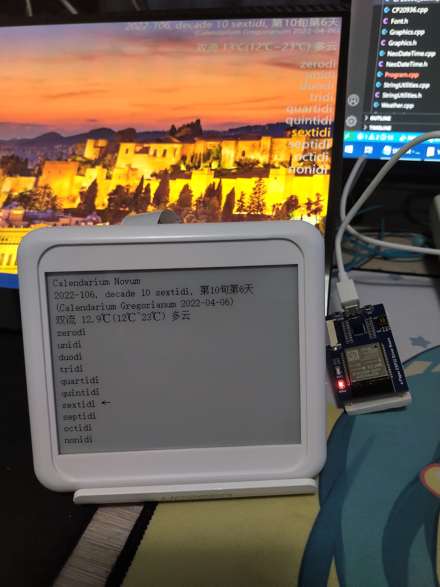

# ESP32入门-电子墨水屏日历

Ianus Inferus

2022-04-10

## 前言

近年来智能手机和智能硬件越来越流行，而这些设备均非常封闭，用户无法像传统台式计算机一样，对这些设备进行完全掌握和再编程。这导致了很多问题，常见的比如：Android手机除了少数品牌外，大多数禁止解锁boot loader，而且即使能解锁boot loader，也有相当数量的硬件驱动是闭源的，导致用户无法自由更换操作系统，甚至很难升级操作系统版本，无法对抗手机制造商和硬件制造商有意和无意的强制植入广告、远程控制手机的行为；大量智能摄像头使用弱密码或存在安全漏洞，导致用户隐私受损。

考虑到形势的发展，不得不提倡用户应该掌握更多的软硬件知识，尽量使用开源软硬件，将命运掌握在自己手中，并以此对抗资本主义和帝国主义的压迫。

在此背景下，我决定学习更多的硬件开发知识，之前已经学习了很有希望的开源CPU架构RISC-V（[制作以RISC-V为目标代码的编译器](../202201/20220125_riscv.html))，这次讲讲最近学习的ESP32芯片。

ESP32是由总部位于上海张江高科技园区的fabless半导体公司乐鑫科技(Espressif)开发的低成本、低功耗微控制器芯片。ESP32和上一代产品ESP8266都是流行的支持WiFi的微控制器。

## 硬件

这次折腾的硬件如下。

[微雪电子墨水屏ESP32驱动板](https://www.waveshare.net/wiki/E-Paper_ESP32_Driver_Board)

[微雪4.2英寸电子墨水屏模块](https://www.waveshare.net/wiki/4.2inch_e-Paper_Module)

其中，驱动板上的ESP32的型号为ESP32-WROOM-32（Xtensa 32-bit LX6 MCU，520KB片上SRAM，4MB集成SPI flash存储），支持WiFi 802.11b/g/n和蓝牙(包括低功耗蓝牙)，支持低功耗模式。

需要注意的有三点：

1. 我拿到的驱动板使用USB接口上传固件需要长按一下BOOT按键才能进行，而乐鑫原厂的一些新版本的开发板应该是没有这个问题的。

2. 驱动板上没有JTAG接口，无法使用gdb进行调试，只能通过串口打印日志来调试。

3. 电子墨水屏每局部刷新几次一定需要进行一次全局刷新，而全局刷新会产生闪烁。

## 开发工具

Visual Studio Code

[PlatformIO](https://platformio.org/)插件

PlatformIO Platform: Espressif 32

最开始尝试使用Arduino IDE进行开发，不过后来发现PlatformIO的界面更现代，并且有项目文件，更具有可重复性，但初次使用需要进行网络下载，可能会存在障碍。

PlatformIO下载的平台包均位于`<用户目录>/.platformio`中。

## 功能

最初设计的功能为显示新日历（以冬至点为起点、去除月亮历影响的纯太阳历日历系统）和显示天气信息。在这两个功能的基础上，有如下难点：

1. 通过网络进行NTP时间同步

    据说一般是使用pool.ntp.org，但由于网络原因，最后换成了腾讯的NTP服务器。

2. 通过网络获取天气信息

    使用了[中国气象局](https://weather.cma.cn)数据。最初发现是https的，还有一点担心，但后来发现http也可以用。此外，JSON解析使用了[ArduinoJson](https://github.com/bblanchon/ArduinoJson)。

3. 显示汉字字符

    由于日历和天气中都有汉字，而天气中的字符是不确定的，所以需要做一个点阵字库。
    字模使用了以前做汉化时写的工具[Firefly字库图片生成器](https://github.com/IanusInferus/firefly)进行提取。
    字符表使用了网上找到的Windows CP20936代码页(GB2312-1980)的内容。
    遇到了一个比较麻烦的问题是字库数据的大小。字库中有字符7580个，每个大小为16*16，占用空间大致为7580\*16\*16/8=242560字节。做成字节数组放到程序中之后，导致编译的固件超过了默认的1280KB。后来发现可以修改`platformio.ini`中的配置`board_build.partitions = huge_app.csv`，将存储的分区改成3072KB，就非常充足了。

4. 电子墨水屏显示

    微雪的示例中有一些很乱的代码，稍加整理，并参考文档，可以得到正确的使用方法。

5. WiFi设置

    网上的大部分示例都是使用固定的WiFi SSID和密码来连接的，需要直接写到代码中，不利于代码分享和部署。    因此使用了[WiFiManager](https://github.com/tzapu/WiFiManager)。这个库可以在首次使用时，创建一个WiFi热点，然后用户可以连接热点中的HTTP服务器进行WiFi设置。设置好后数据会存储到Flash中，断电后再次启动可以直接读取。

## 源代码

[CalendariumNovumESP32](https://github.com/IanusInferus/CalendariumNovumESP32)

## 后记

大学的时候学习过Keil C51平台的微控制器，当时是以C代码为主来进行实现的，而且定时器都需要自己测量指令周期来实现。现在的ESP32，虽然使用了gcc，且版本很低，但可以直接使用C++，可以动态分配和释放内存，可以使用异常，可用的库大幅丰富，开发起来简单了很多。

ESP32也可以使用[clang](https://github.com/espressif/llvm-project)，并且也有使用RISC-V的芯片[ESP32-C3](https://www.espressif.com/en/news/ESP32_C3)，生态上应该会持续发展。
